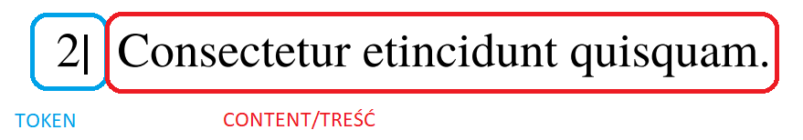

# Instruction for marking exam

## Each .zip archive contains
* `<exam_id>.pdf` - PDF version of exam that is expected to be printed
* `<exam_id>.txt` - Text file containing answers that have to be marked on printed exam

## Interpretation of answers for exams

Example of single question in `<exam_id>.txt` file

|             | Answer 1   | Answer 2   | Answer 3   | Answer 4   | Answer 5   | Answer 6   |
|-------------|------------|------------|------------|------------|------------|------------|
|.............|............|............|............|............|............|............|
| Question 8  | negation   | mark       | no mark    | no mark    |            |            |
|.............|............|............|............|............|............|............|

### Marks used in answers file:

* `mark` - student is expected to mark this answer as correct
    - **EXACT WAY OF MARKING IS PLACED AT THE BEGINNING OF EACH PDF EXAM FILE**
* `no mark` - student is expected to leave it unmarked
* `negation` - student is expected to first mark this answer as correct and then negate it
    - **EXACT WAY OF MARKING IS PLACED AT THE BEGINNING OF EACH PDF EXAM FILE**
* `____` - (empty space) - this question doesn't have enough answer, no action required

## Rules

1. Strictly follow marks and negations in the `.txt` file. Keep in mind to add your index at the beginning of each exam in the rectangle at top of the page.
2. If any mistake occurs during the filling exam, eg. you mark the answer that has to be unmarked or negate the answer that has to remain marked please print a blank page and fill it again, in the correct way.
3. Keep order for each exam during scanning it
4. Print each exam in black and white.
5. After filling all exams you have to either:
    * Scan all the exams using your scanner. Please keep the order on exam pages

    OR

    * Bring filled exams (keeping the order in exam pages) to the teacher's room (EA 521) at a pre-arranged time
6. Don't write anything below or on UUID. If there is anything scratched on UUID, please print a blank copy of the exam page to which it applies.

## Scanning using own resources

This applies ONLY if you are going to scan exams using your resources
1. Scan all exams (using scanner, not phone camera with application) in remaining order inside exams.
2. Save all exams in a single file in `.pdf` format. Feel free to keep blank pages in between exams. Name the file `index_no.pdf`.
3. Compress pdf file to `.zip` archive. Please name it `index_no.zip`. Don't set any password to this archive.

## Important Notes

* Each exam has its method of marking and negation of answers (it is described at the beginning of the exam)

* Negation is meant to cancel mark, therefor answer has to be marked first, and then canceled. Drawing only a "negation mark" isn't enough.

* Marking (and negation) for the answer is related to token. The token is the part of the answer appearing right before the answer content.

